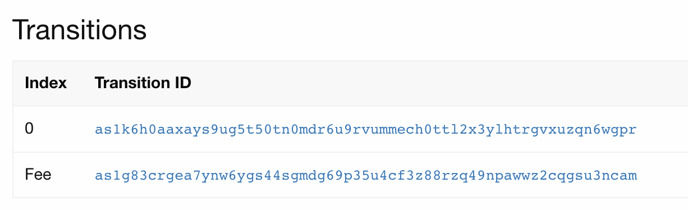
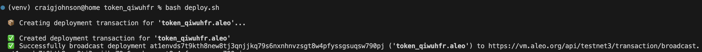

# Aleo Deployment Demo

In this repository we will go through the steps to deploy your own Leo program on the Aleo Network.

## Prerequisites

Make sure you have the following software installed on your local machine:

### Software Installation

1.  [Install Git](https://git-scm.com/downloads)
2.  [Install Rust](https://www.rust-lang.org/tools/install)
3.  [Install Leo](https://developer.aleo.org/leo/installation)
4.  [Install snarkos](https://developer.aleo.org/testnet/getting_started/installation/)
5.  [Install Leo Wallet](https://leo.app/)
6.  [Install VSCode](https://code.visualstudio.com/download)

### Create a Leo Wallet

You will need a Leo Wallet to deploy your program. You can create a wallet by running the following command:

`leo account new`

Be sure to save the Address, View and Private Keys of this wallet, you will need them later.

Alternatively you can

1. Create the wallet via Leo Wallet if you installed the above Chrome Extension
2. Import the wallet into Leo Wallet you created via `leo account new` using the private key

### Get Testnet Tokens

You can get testnet tokens by using the [Aleo Faucet](https://faucet.aleo.org/).

## Deployment Demo

### Step 1: Initalize a Leo Project

Run the following command to initalize a leo project, be sure to replace `<project_name>` with the name of your project.
In Leo, programs must be unique, so make sure to use a unique name.

`leo new <project_name>`

The result will be a new folder `project_name` with the following structure:

```
.
├── README.md
├── build
│   ├── main.aleo
│   └── program.json
├── inputs
│   └── deploy_workshop.in
├── program.json
└── src
    └── main.leo
```

### Step 2: Write your program

Write your code in the `src/main.leo` file. For this demo we will be using the following code that implements a basic token.

```
// Replace <project_name> with the name of your project.
program <project_name>.aleo {
    // Define a token struct with an owner and balance
    record Token {
        owner: address,
        balance: u32,
    }

    // Define a mint transition that takes a balance and returns a token
    transition mint(balance: u32) -> Token {
        return Token {
            owner: self.caller,
            balance: balance,
        };
    }

    // Define a transfer transition that takes a receiver, amount and token and returns two tokens
    transition transfer(receiver: address, amount: u32, input: Token) -> (Token, Token) {
        let balance: u32 = input.balance - amount;
        let recipient: Token = Token {
            owner: receiver,
            balance: amount,
        };

        let sender: Token  = Token {
            owner: self.caller,
            balance
        };

        return (recipient, sender);
    }
}
```

### Define Inputs

In the `./inputs/project_name.in` file, we need to define the inputs for our program. For this demo we will be using the following inputs:

```
// The program input for deploy_workshop/src/main.leo
[mint]
balance: u32 = 100u32;

[transfer]
receiver: address = aleo1yn6halw6astkc8jsl88sukelef3e8xrawugfjtx7kjcuuxdm6spsdtc249;
amount: u32 = 10u32;
input: Token = Token {
  owner: aleo102nryeeun6da4atqggu0q9aj5cqem7tpjzvce4nc88yzu29n8sgs9qelp7,
  balance: 100u32,
  _nonce: 661901642905281065575358583071347542160248627750537954509114007526888699661group
};
```

### Build & Test our Program

Let's make sure that our program is working by running the following commands:

1. Does it build? `leo build`
   `Leo ✅ Compiled 'main.leo' into Aleo instructions`
2. Can we mint tokens? `leo run mint`
   You should see the following output:

```
{
  owner: aleo102nryeeun6da4atqggu0q9aj5cqem7tpjzvce4nc88yzu29n8sgs9qelp7.private,
  balance: 100u32.private,
  _nonce: 292936196563333932009136915121914006898609101920119023221288671394356999564group.public
}
```

Copy the output record from the mint transition and paste it into the `./inputs/project_name.in` file under the `[transfer]` section. Be sure to remove the `.private` and `.group` suffixes.

3. Can we transfer tokens? `leo run transfer`

```craigjohnson@home deploy_workshop % leo run transfer
       Leo ✅ Compiled 'main.leo' into Aleo instructions

⛓  Constraints

 •  'deploy_workshop.aleo/transfer' - 4,075 constraints (called 1 time)

➡️  Outputs

 • {
  owner: aleo1yn6halw6astkc8jsl88sukelef3e8xrawugfjtx7kjcuuxdm6spsdtc249.private,
  balance: 10u32.private,
  _nonce: 3050046340461200467640466967043652446168052649619713936697821365575779437863group.public
}
 • {
  owner: aleo102nryeeun6da4atqggu0q9aj5cqem7tpjzvce4nc88yzu29n8sgs9qelp7.private,
  balance: 90u32.private,
  _nonce: 7955845234401838954345597221810328519950488237684582098690500295625246536712group.public
}
```

You can see here, one account now has 90 tokens and the other has 10, meaning we succesfully transfered 10 tokens.

### Step 3. Getting our Record Plaintext

We need to retrieve our Wallet's current record plaintext to deploy our program. I prefer to use the Leo Wallet to do this

1. Open the Leo Wallet
2. Click on the Wallet you created in the Prerequisites
3. Click on the Activities tab and click into the most recent transaction, this opens a new window in a block explorer
4. You should see this page
   
5. Click on the first transition ID, this will open a new page
6. Connect your wallet, scroll down and retrieve your record data, it should be highlighted in green text, save this text for the next step

### Step 4. Create our Deployment Script

We need a few environment variables set to deploy our program. We can create a script to set these variables for us.

Create a new file named `deploy.sh` in the project directory and copy the following into the file

```

WALLETADDRESS=""
PRIVATEKEY=""

APPNAME="<project_name>"
PATHTOAPP=$(realpath -q $APPNAME)

RECORD="{
RECORD PLAINTEXT HERE
}"

cd .. && snarkos developer deploy "${APPNAME}.aleo" --private-key "${PRIVATEKEY}" --query "https://vm.aleo.org/api" --path "./${APPNAME}/build/" --broadcast "https://vm.aleo.org/api/testnet3/transaction/broadcast" --fee 1000000 --record "${RECORD}"``

```

Fill out the variables with the appropriate values and save the file

### Step 5. Execute the Script to Deploy our Program

Run the deploy script

`bash ./deploy.sh`

You see output like this if successful

